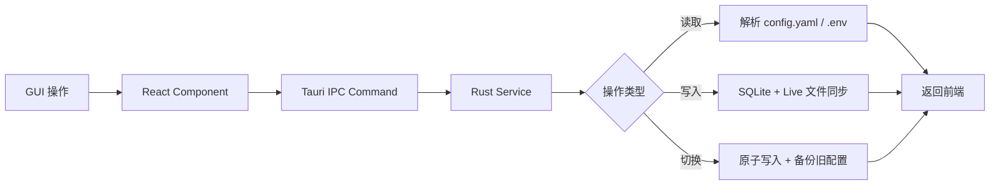

# 🔮 Hermes Agent Switch — 完整实施计划书

> **项目名称**: Hermes Agent Switch (HermesSwitch)  
> **项目定位**: 专为 Hermes Agent 打造的跨平台桌面 All-in-One 管理工具  
> **创建日期**: 2026-04-12  
> **灵感来源**: [CC Switch](https://github.com/farion1231/cc-switch) (43k stars)

---

## 一、CC Switch 深度分析

### 1.1 CC Switch 是什么

CC Switch 是一个跨平台桌面应用，统一管理 5 款 AI CLI 编程工具（Claude Code、Codex、Gemini CLI、OpenCode、OpenClaw）。核心解决了以下痛点：

| 痛点 | CC Switch 的解决方案 |
|------|---------------------|
| 各工具配置格式不同（JSON/TOML/.env） | 统一 GUI 界面管理所有配置 |
| 切换 API 供应商需手动编辑文件 | 一键切换 + 系统托盘快捷切换 |
| MCP 和 Skills 缺乏统一管理 | 统一面板跨 4 个应用双向同步 |
| 配置容易损坏 | SQLite + 原子写入 + 自动备份 |

### 1.2 CC Switch 技术架构

```
┌─────────────────────────────────────────────────────────────┐
│ Frontend (React + TS + Vite + TailwindCSS + shadcn/ui)      │
│   Components → Hooks（业务逻辑）→ TanStack Query（缓存/同步）  │
└────────────────────────┬────────────────────────────────────┘
                         │ Tauri IPC
┌────────────────────────▼────────────────────────────────────┐
│ Backend (Tauri 2.8 + Rust)                                   │
│   Commands → Services → Database(SQLite DAO)                 │
└─────────────────────────────────────────────────────────────┘
```

**核心设计原则**:
- **SSOT**: 所有数据存储在 `~/.cc-switch/cc-switch.db`（SQLite）
- **双层存储**: SQLite 存可同步数据，JSON 存设备级设置
- **双向同步**: 切换时写入 live 文件，编辑活跃 provider 时从 live 回填
- **原子写入**: 临时文件 + rename 模式防止配置损坏
- **分层架构**: Commands → Services → DAO → Database

### 1.3 CC Switch 核心模块

| 模块 | 功能 |
|------|------|
| ProviderService | 供应商 CRUD、切换、回填、排序 |
| McpService | MCP 服务器管理、导入导出、live 同步 |
| ProxyService | 本地代理模式、热切换、格式转换 |
| SessionManager | 跨应用会话历史浏览 |
| ConfigService | 配置导入导出、备份轮转 |
| SkillService | Skills 统一管理、symlink 支持 |
| SpeedtestService | API 延迟测试 |

### 1.4 CC Switch 技术栈

- **代码比例**: Rust 54.5% / TypeScript 43.1% / HTML 2.0%
- **前端**: React 18 · TypeScript · Vite · TailwindCSS 3.4 · TanStack Query v5 · shadcn/ui · react-i18next
- **后端**: Tauri 2.8 · Rust · serde · tokio · thiserror
- **测试**: vitest · MSW · @testing-library/react
- **数据**: SQLite (rusqlite) + JSON (设备设置)

---

## 二、Hermes Agent 深度分析

### 2.1 Hermes Agent 是什么

Hermes Agent 是 Nous Research 开发的开源自改进 AI Agent，核心特点：

- **模型无关**: 支持 20+ 供应商（OpenRouter、Anthropic、Google、GLM、Kimi、MiniMax 等）
- **多后端执行**: local / docker / ssh / modal / singularity / daytona
- **40+ 内置工具**: 终端、文件、浏览器、搜索、代码执行、图像生成
- **持久记忆**: MEMORY.md + USER.md 跨会话记忆
- **多平台网关**: Telegram / Discord / Slack / WhatsApp / Email / Signal
- **MCP 支持**: 原生 MCP 服务器集成（stdio + HTTP）
- **Skills 系统**: 可复用技能库 + GitHub 集成
- **上下文压缩**: 自动压缩长对话

### 2.2 Hermes Agent 配置体系（三层架构）

| 层级 | 文件 | 格式 | 内容 |
|------|------|------|------|
| 环境变量 | `~/.hermes/.env` | dotenv | API Keys、工具配置、集成凭证（300+ 行） |
| CLI 配置 | `~/.hermes/config.yaml` | YAML | 模型、终端、压缩、Skills、Agent 行为（800+ 行） |
| 持久记忆 | `~/.hermes/MEMORY.md` + `USER.md` | Markdown | Agent 记忆和用户画像 |

### 2.3 支持的 LLM Provider（16+）

1. **OpenRouter** — 通过一个 API 访问多模型
2. **Google AI Studio / Gemini** — 原生 Gemini API
3. **z.ai / GLM** — 智谱 AI GLM 模型
4. **Kimi / Moonshot** — 月之暗面编程模型
5. **MiniMax (Global / CN)** — MiniMax 全球/中国端点
6. **OpenCode Zen / Go** — OpenCode 平台
7. **Hugging Face** — HF 推理供应商
8. **Xiaomi MiMo** — 小米 MiMo 模型
9. **Anthropic** — 直连 Anthropic API
10. **OpenAI Codex** — OpenAI Codex OAuth
11. **GitHub Copilot** — GitHub Models
12. **Nous Portal** — Nous 自有平台（OAuth + API）
13. **Qwen OAuth** — 通义千问本地 OAuth
14. **KiloCode** — KiloCode 网关
15. **Vercel AI Gateway** — Vercel AI 网关
16. **自定义端点** — LM Studio / Ollama / vLLM / llama.cpp

### 2.4 Hermes vs CC Switch 配置对比

| 维度 | CC Switch 管理的工具 | Hermes Agent |
|------|---------------------|--------------|
| 配置格式 | JSON / TOML / .env（5种工具各不同） | YAML + .env（统一） |
| 供应商数量 | 50+ 预设 | 16+ 内置供应商 |
| MCP | 跨 4 app 同步 | 单应用，config.yaml 中定义 |
| Skills | symlink 跨 app | 内置 ~/.hermes/skills/ |
| 会话 | 各工具独立历史 | SQLite 持久会话 |
| 终端后端 | 无（各工具自己管理） | 6 种后端（local/docker/ssh/modal...） |
| 多平台网关 | 无 | Telegram/Discord/Slack/WhatsApp/Email |

---

## 三、Hermes Agent Switch — 产品定位

### 3.1 核心价值主张

> **Hermes Agent Switch** 是专为 Hermes Agent 打造的桌面管理中心，让你通过可视化界面管理 Hermes 的一切配置 — 而无需手动编辑 YAML 和 .env 文件。

### 3.2 解决的痛点

| 痛点 | HermesSwitch 的解决方案 |
|------|------------------------|
| .env 文件有 300+ 行，手动编辑容易出错 | GUI 分类管理所有 API Keys |
| config.yaml 有 800+ 行，结构复杂 | 可视化编辑器，分模块管理 |
| 切换 LLM Provider 需要改多处配置 | 一键切换供应商方案 |
| MCP 服务器配置语法复杂 | 可视化 MCP 管理面板 |
| Skills 管理散落在文件系统 | 统一 Skills Hub 面板 |
| 终端后端切换需改配置 | 后端快速切换面板 |
| 网关集成配置繁琐 | 可视化网关管理 |
| 配置无版本管理 | 方案快照 + 一键回滚 |

### 3.3 目标用户

1. **Hermes Agent 日常用户** — 需要频繁切换模型/供应商
2. **多模型实验者** — 对比不同 Provider 的效果和成本
3. **团队协作者** — 需要统一配置方案并分享
4. **自部署运维** — 管理多个 Hermes 实例（本地 + 远程）

---

## 四、技术架构设计

### 4.1 技术栈选择

参考 CC Switch 的成熟架构，采用相同的技术栈以降低风险：

| 层级 | 技术 | 原因 |
|------|------|------|
| **桌面框架** | Tauri 2 | 轻量、跨平台、Rust 后端安全高效 |
| **前端** | React 18 + TypeScript + Vite | 生态成熟、CC Switch 已验证 |
| **UI 组件** | shadcn/ui + TailwindCSS | 美观、可定制、一致性强 |
| **状态管理** | TanStack Query v5 | 缓存同步、乐观更新 |
| **后端** | Rust + serde + tokio | 类型安全、高性能 |
| **数据库** | SQLite (rusqlite) | 单文件、原子写入、CC Switch 已验证 |
| **配置解析** | serde_yaml + dotenv | 原生支持 Hermes 配置格式 |
| **国际化** | react-i18next | 中/英双语 |

### 4.2 整体架构

```
┌─────────────────────────────────────────────────────────────────┐
│                    Hermes Agent Switch (Desktop App)             │
├─────────────────────────────────────────────────────────────────┤
│                                                                  │
│  ┌──────────────────── Frontend (React + TS) ──────────────────┐│
│  │                                                              ││
│  │  ┌────────────┐  ┌────────────┐  ┌──────────┐  ┌─────────┐ ││
│  │  │ Provider   │  │    MCP     │  │  Skills  │  │ Gateway │ ││
│  │  │ Manager    │  │   Panel    │  │   Hub    │  │  Panel  │ ││
│  │  └────────────┘  └────────────┘  └──────────┘  └─────────┘ ││
│  │  ┌────────────┐  ┌────────────┐  ┌──────────┐  ┌─────────┐ ││
│  │  │ Terminal   │  │  Session   │  │  Memory  │  │Settings │ ││
│  │  │ Backend    │  │  Browser   │  │  Editor  │  │  Panel  │ ││
│  │  └────────────┘  └────────────┘  └──────────┘  └─────────┘ ││
│  │                                                              ││
│  │  Hooks (Business Logic) → TanStack Query (Cache/Sync)       ││
│  └──────────────────────────────────────────────────────────────┘│
│                              │ Tauri IPC                         │
│  ┌──────────────────── Backend (Rust) ─────────────────────────┐│
│  │                                                              ││
│  │  Commands ──→ Services ──→ Database (SQLite)                 ││
│  │                   │                                          ││
│  │                   ├──→ ConfigParser (YAML + .env)            ││
│  │                   ├──→ FileSync (Live 文件读写)               ││
│  │                   └──→ BackupService (快照 + 轮转)           ││
│  └──────────────────────────────────────────────────────────────┘│
│                              │                                   │
│  ┌──────────── Hermes Agent Config Files ──────────────────────┐│
│  │  ~/.hermes/.env                                              ││
│  │  ~/.hermes/config.yaml                                       ││
│  │  ~/.hermes/MEMORY.md + USER.md                               ││
│  │  ~/.hermes/skills/                                           ││
│  │  ~/.hermes/sessions.db                                       ││
│  └──────────────────────────────────────────────────────────────┘│
└─────────────────────────────────────────────────────────────────┘
```

### 4.3 数据流设计



### 4.4 核心设计原则

| 原则 | 说明 |
|------|------|
| **最小侵入** | 卸载后 Hermes Agent 继续正常工作 |
| **原子写入** | 临时文件 + rename，防止配置损坏 |
| **双向同步** | GUI ↔ Live 文件双向感知 |
| **方案快照** | 每次切换前自动备份，支持回滚 |
| **SSOT** | SQLite 作为配置元数据的唯一真相源 |

---

## 五、功能模块详细设计

### 5.1 Provider Manager（供应商管理）⭐ 核心模块

**目标**: 一键切换 Hermes Agent 的 LLM 供应商配置

```
┌─────────────────────────────────────────────┐
│          Provider Manager                    │
├─────────────────────────────────────────────┤
│                                              │
│  [+ 添加供应商]  [导入预设]  [导出方案]       │
│                                              │
│  ┌──────────────────────────────────────────┐│
│  │ ★ OpenRouter (当前激活)          [切换]  ││
│  │   Model: anthropic/claude-opus-4.6       ││
│  │   Base URL: https://openrouter.ai/api/v1 ││
│  ├──────────────────────────────────────────┤│
│  │   Google Gemini                  [切换]  ││
│  │   Model: gemini-3-flash-preview          ││
│  ├──────────────────────────────────────────┤│
│  │   z.ai / GLM                    [切换]  ││
│  │   Model: glm-4-plus                     ││
│  ├──────────────────────────────────────────┤│
│  │   自定义 (Ollama Local)          [切换]  ││
│  │   Base URL: http://localhost:11434/v1    ││
│  └──────────────────────────────────────────┘│
└─────────────────────────────────────────────┘
```

**数据模型**:
```rust
struct HermesProvider {
    id: String,           // UUID
    name: String,         // 显示名称
    provider_type: String, // openrouter / gemini / anthropic / custom ...
    model: String,        // 模型名称
    api_key: String,      // 加密存储
    base_url: Option<String>,
    extra_config: serde_json::Value, // provider_routing 等额外配置
    is_current: bool,
    sort_order: i32,
    created_at: String,
    updated_at: String,
}
```

**内置预设（16+）**: OpenRouter, Anthropic, Google Gemini, z.ai/GLM, Kimi/Moonshot, MiniMax (Global/CN), OpenCode (Zen/Go), Hugging Face, Xiaomi MiMo, GitHub Copilot, Nous Portal, Qwen OAuth, Custom (Ollama, LM Studio, vLLM, llama.cpp)

**切换逻辑**:
1. 备份当前 config.yaml 和 .env
2. 更新 config.yaml 中的 `model` 段（model, provider, base_url）
3. 更新 .env 中对应的 API_KEY 环境变量
4. 原子写入两个文件
5. 更新 SQLite 中的 `is_current` 状态

### 5.2 MCP Manager（MCP 服务器管理）

**目标**: 可视化管理 Hermes 的 MCP 服务器配置

**功能**:
- 添加/编辑/删除 MCP 服务器（stdio + HTTP）
- 内置模板（GitHub、Filesystem、Notion、Time 等）
- 开关单个 MCP 服务器（enable/disable）
- 环境变量绑定管理
- Sampling 配置面板
- 导入/导出 MCP 配置

**数据模型**:
```rust
struct McpServer {
    id: String,
    name: String,
    server_type: String,      // "stdio" | "http"
    command: Option<String>,   // stdio: 执行命令
    args: Vec<String>,         // stdio: 命令参数
    url: Option<String>,       // http: 服务端点
    headers: HashMap<String, String>,
    env: HashMap<String, String>,
    timeout: Option<u32>,
    connect_timeout: Option<u32>,
    sampling: Option<SamplingConfig>,
    enabled: bool,
    sort_order: i32,
}
```

### 5.3 Skills Hub（Skills 管理）

**目标**: 统一管理 Hermes 的技能库

**功能**:
- 浏览 `~/.hermes/skills/` 中的已安装技能
- 从 GitHub 仓库搜索和安装技能
- 技能启用/禁用开关
- 外部技能目录管理（external_dirs）
- 技能内容预览（Markdown 渲染）
- 创建自定义技能

### 5.4 Terminal Backend Manager（终端后端管理）⭐ 独有功能

**目标**: 可视化切换 Hermes 的终端执行后端

这是 **HermesSwitch 独有的功能**（CC Switch 没有），因为 Hermes 支持 6 种后端。

```
┌──────────────────────────────────────────┐
│        Terminal Backend                   │
├──────────────────────────────────────────┤
│                                           │
│  ● Local (当前)    ○ Docker               │
│  ○ SSH             ○ Modal                │
│  ○ Singularity     ○ Daytona             │
│                                           │
│  ─── Local 配置 ──────────────────────── │
│  CWD:     [.                          ]  │
│  Timeout: [180] seconds                   │
│  Lifetime: [300] seconds                  │
│                                           │
│  ─── 容器资源 ────────────────────────── │
│  CPU:    [1] cores                        │
│  Memory: [5120] MB                        │
│  Disk:   [51200] MB                       │
│  Persistent: [✓]                          │
│                                           │
│  [应用更改]                               │
└──────────────────────────────────────────┘
```

### 5.5 Gateway Manager（网关管理）⭐ 独有功能

**目标**: 可视化管理 Telegram/Discord/Slack/WhatsApp/Email/Signal 集成

**功能**:
- 各平台凭证/Token 管理
- 允许用户列表管理
- Webhook 配置
- 流式传输配置
- 会话重置策略配置
- 启停状态监控

### 5.6 Session Browser（会话浏览器）

**目标**: 浏览和搜索 Hermes 的对话历史

**功能**:
- 读取 `logs/session_*.json` 文件
- 搜索会话内容
- 查看完整对话轨迹（system, user, assistant, tool calls）
- 时间线视图

### 5.7 Memory Editor（记忆编辑器）⭐ 独有功能

**目标**: 可视化编辑 Hermes 的持久记忆

**功能**:
- 编辑 `~/.hermes/MEMORY.md`（Agent 笔记）
- 编辑 `~/.hermes/USER.md`（用户画像）
- Markdown 实时预览
- 字符数限制提示（memory: 2200 chars, user: 1375 chars）
- 记忆配置面板（enabled, char_limit, nudge_interval）

### 5.8 Config Editor（配置编辑器）

**目标**: 高级用户的直接配置编辑能力

**功能**:
- config.yaml 全文编辑（带语法高亮）
- .env 文件编辑（敏感值隐藏）
- 配置差异对比
- 配置方案快照和恢复

### 5.9 Settings（设置面板）

**功能**:
- Hermes Agent 安装路径检测
- 主题切换（Dark/Light/System）
- 语言切换（中/英）
- 自动启动
- 最小化到托盘
- 备份管理
- 云同步配置（WebDAV/iCloud/Dropbox）

---

## 六、数据库 Schema 设计

```sql
-- 供应商配置表
CREATE TABLE providers (
    id TEXT PRIMARY KEY,
    name TEXT NOT NULL,
    provider_type TEXT NOT NULL,
    model TEXT NOT NULL,
    api_key TEXT,          -- 加密字段
    base_url TEXT,
    extra_config TEXT,     -- JSON
    is_current INTEGER DEFAULT 0,
    sort_order INTEGER DEFAULT 0,
    created_at TEXT NOT NULL,
    updated_at TEXT NOT NULL
);

-- MCP 服务器配置表
CREATE TABLE mcp_servers (
    id TEXT PRIMARY KEY,
    name TEXT NOT NULL,
    server_type TEXT NOT NULL,   -- stdio / http
    command TEXT,
    args TEXT,                   -- JSON array
    url TEXT,
    headers TEXT,                -- JSON object
    env_vars TEXT,               -- JSON object
    timeout INTEGER,
    connect_timeout INTEGER,
    sampling_config TEXT,        -- JSON
    enabled INTEGER DEFAULT 1,
    sort_order INTEGER DEFAULT 0,
    created_at TEXT NOT NULL,
    updated_at TEXT NOT NULL
);

-- Skills 表
CREATE TABLE skills (
    id TEXT PRIMARY KEY,
    name TEXT NOT NULL,
    description TEXT,
    file_path TEXT NOT NULL,
    source TEXT,                 -- github / local / custom
    source_url TEXT,
    enabled INTEGER DEFAULT 1,
    content TEXT,
    created_at TEXT NOT NULL,
    updated_at TEXT NOT NULL
);

-- 终端后端配置表
CREATE TABLE terminal_backends (
    id TEXT PRIMARY KEY,
    name TEXT NOT NULL,
    backend_type TEXT NOT NULL,  -- local/docker/ssh/modal/singularity/daytona
    config TEXT NOT NULL,        -- JSON (各后端特有配置)
    is_current INTEGER DEFAULT 0,
    created_at TEXT NOT NULL,
    updated_at TEXT NOT NULL
);

-- 网关配置表
CREATE TABLE gateways (
    id TEXT PRIMARY KEY,
    platform TEXT NOT NULL,     -- telegram/discord/slack/whatsapp/email/signal
    config TEXT NOT NULL,       -- JSON (各平台特有配置)
    enabled INTEGER DEFAULT 0,
    created_at TEXT NOT NULL,
    updated_at TEXT NOT NULL
);

-- 配置快照备份表
CREATE TABLE config_snapshots (
    id TEXT PRIMARY KEY,
    name TEXT,
    env_content TEXT,
    yaml_content TEXT,
    created_at TEXT NOT NULL,
    trigger TEXT                -- manual / auto_switch / auto_backup
);

-- 设置表 (key-value)
CREATE TABLE settings (
    key TEXT PRIMARY KEY,
    value TEXT NOT NULL
);

-- Schema 版本
CREATE TABLE schema_version (
    version INTEGER PRIMARY KEY
);
```

---

## 七、项目目录结构

```
HermesSwitch/
├── src/                          # Frontend (React + TypeScript)
│   ├── components/
│   │   ├── providers/            # 供应商管理面板
│   │   ├── mcp/                  # MCP 服务器管理面板
│   │   ├── skills/               # Skills 管理面板
│   │   ├── terminal/             # 终端后端管理面板
│   │   ├── gateway/              # 网关管理面板
│   │   ├── sessions/             # 会话浏览器
│   │   ├── memory/               # 记忆编辑器
│   │   ├── config/               # 高级配置编辑器
│   │   ├── settings/             # 设置面板
│   │   └── ui/                   # shadcn/ui 组件库
│   ├── hooks/                    # 自定义 hooks (业务逻辑)
│   ├── lib/
│   │   ├── api/                  # Tauri API 包装 (type-safe)
│   │   └── query/                # TanStack Query 配置
│   ├── locales/                  # 国际化 (zh/en)
│   ├── config/                   # 预设配置 (providers/mcp)
│   ├── types/                    # TypeScript 类型定义
│   ├── App.tsx
│   └── main.tsx
├── src-tauri/                    # Backend (Rust)
│   ├── src/
│   │   ├── commands/             # Tauri 命令层 (按域名划分)
│   │   │   ├── provider.rs
│   │   │   ├── mcp.rs
│   │   │   ├── skill.rs
│   │   │   ├── terminal.rs
│   │   │   ├── gateway.rs
│   │   │   ├── session.rs
│   │   │   ├── memory.rs
│   │   │   ├── config.rs
│   │   │   └── settings.rs
│   │   ├── services/             # 业务逻辑层
│   │   │   ├── provider.rs
│   │   │   ├── mcp.rs
│   │   │   ├── skill.rs
│   │   │   ├── terminal.rs
│   │   │   ├── gateway.rs
│   │   │   ├── session.rs
│   │   │   ├── memory.rs
│   │   │   ├── config.rs
│   │   │   └── backup.rs
│   │   ├── database/             # SQLite DAO 层
│   │   │   ├── mod.rs
│   │   │   ├── provider_dao.rs
│   │   │   ├── mcp_dao.rs
│   │   │   ├── skill_dao.rs
│   │   │   ├── terminal_dao.rs
│   │   │   ├── gateway_dao.rs
│   │   │   └── settings_dao.rs
│   │   ├── parsers/              # 配置文件解析器
│   │   │   ├── yaml_parser.rs    # config.yaml 解析
│   │   │   ├── env_parser.rs     # .env 解析
│   │   │   └── memory_parser.rs  # MEMORY.md / USER.md
│   │   ├── sync/                 # 文件同步模块
│   │   │   ├── file_sync.rs      # Live 文件读写
│   │   │   └── atomic_write.rs   # 原子写入
│   │   ├── error.rs
│   │   ├── lib.rs
│   │   └── main.rs
│   ├── Cargo.toml
│   ├── tauri.conf.json
│   └── icons/
├── tests/                        # 前端测试
├── assets/                       # 截图和资源
├── .gitignore
├── package.json
├── tsconfig.json
├── vite.config.ts
├── vitest.config.ts
├── tailwind.config.cjs
├── postcss.config.cjs
├── components.json               # shadcn/ui 配置
└── README.md
```

---

## 八、开发路线图

### Phase 1: 基础框架搭建（1-2 周）

> **目标**: 完成项目骨架，能运行起来

- [ ] Tauri 2 项目初始化
- [ ] React + Vite + TypeScript 前端设置
- [ ] TailwindCSS + shadcn/ui 集成
- [ ] 基础 UI 布局（侧边栏导航 + 内容区）
- [ ] SQLite 数据库初始化
- [ ] Hermes Agent 路径检测逻辑
- [ ] 主题系统（Dark/Light）
- [ ] 国际化框架（中/英）

### Phase 2: 核心功能 — Provider Manager（1-2 周）

> **目标**: 实现一键切换供应商的核心能力

- [ ] .env 文件解析器（读取已有 API Keys）
- [ ] config.yaml 解析器（读取 model 配置）
- [ ] Provider CRUD UI
- [ ] 16+ 内置预设
- [ ] 一键切换逻辑（.env + config.yaml 原子写入）
- [ ] 配置备份/回滚
- [ ] 系统托盘快捷切换

### Phase 3: MCP + Skills 管理（1 周）

- [ ] MCP 服务器 CRUD
- [ ] MCP 模板库
- [ ] Skills Hub：浏览/安装/启用/禁用
- [ ] Skills 外部目录管理
- [ ] Markdown 技能预览

### Phase 4: Terminal + Gateway + Session（1-2 周）

- [ ] 终端后端 6 种配置面板
- [ ] 网关平台凭证管理
- [ ] 会话浏览器（读取 session log JSON）
- [ ] 记忆编辑器（MEMORY.md + USER.md）

### Phase 5: 高级功能（1 周）

- [ ] 高级配置编辑器（YAML/ENV 直接编辑）
- [ ] 配置方案导入/导出
- [ ] 云同步（WebDAV/iCloud）
- [ ] API 延迟测试
- [ ] 自动更新机制

### Phase 6: 打包发布（1 周）

- [ ] macOS .dmg 签名 + 公证
- [ ] Windows .msi 安装包
- [ ] Linux .deb / .rpm / .AppImage
- [ ] GitHub Release 自动化
- [ ] README + 文档

---

## 九、与 CC Switch 的差异化特性

| 特性 | CC Switch | HermesSwitch |
|------|-----------|-------------|
| 管理目标 | 5 款 CLI 工具（广度优先） | 1 款 Hermes Agent（深度优先） |
| Provider 切换 | 多工具配置同步 | .env + config.yaml 联动 |
| 终端后端管理 | ❌ | ✅ 6 种后端可视化管理 |
| 网关管理 | ❌ | ✅ 6 个平台集成管理 |
| 持久记忆编辑 | ❌ | ✅ MEMORY.md + USER.md 编辑器 |
| 上下文压缩配置 | ❌ | ✅ 压缩策略可视化配置 |
| Agent 行为调优 | ❌ | ✅ reasoning_effort、max_turns 等 |
| 代理服务器 | ✅ 本地代理 + 故障转移 | 🔮 后续可考虑 |
| Deep Link | ✅ ccswitch:// | 🔮 hermesswitch:// |

---

## 十、关键技术挑战

| 挑战 | 解决方案 |
|------|---------|
| YAML 保留注释和格式 | 使用 `yaml-rust2` 保留格式，或 `serde_yaml` + 字段级精确更新 |
| .env 文件解析（# 注释 + 引号值） | 使用 `dotenvy` crate 加自定义 writer |
| 密钥安全存储 | SQLite + OS Keychain (tauri-plugin-store) |
| 配置文件冲突（外部修改） | 文件 mtime 检测 + 冲突提示弹窗 |
| Hermes 版本兼容 | 配置格式版本检测 + 向下兼容层 |
| 原子写入跨平台差异 | 临时文件写入同一目录 + rename（保证同文件系统） |

---

## 十一、环境配置

### 开发环境要求

- **Node.js**: ≥ 18
- **pnpm**: ≥ 8
- **Rust**: ≥ 1.85
- **Tauri CLI**: ≥ 2.8

### 开发命令

```bash
# 安装依赖
pnpm install

# 开发模式（热重载）
pnpm dev

# 类型检查
pnpm typecheck

# 构建应用
pnpm build

# Rust 后端开发
cd src-tauri && cargo fmt      # 格式化
cd src-tauri && cargo clippy   # 检查
cd src-tauri && cargo test     # 测试

# 前端测试
pnpm test:unit
```

---

> **下一步**: 确认本计划后，我将从 Phase 1 开始搭建基础框架。建议优先实现 Phase 1 + Phase 2（Provider Manager），让核心功能先跑起来，其他模块逐步迭代。
